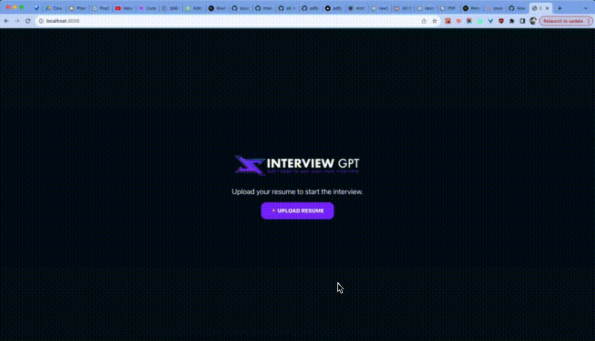

# Interview Pro - AI-Powered Interview Training

This application provides AI-powered interview training with resume analysis. It utilizes PDF.js for resume extraction and OpenAI GPT for personalized interview questions.

## Application Overview

This chatbot helps you prepare for behavioral interviews by:
1. Uploading your resume PDF
2. Extracting relevant information using PDF.js
3. Generating personalized interview questions with OpenAI
4. Conducting a simulated interview with voice interaction

## Testing PDF.js Extraction on Vercel

To test PDF.js extraction capabilities in a serverless environment:

1. Navigate to `/test-pdf-extraction` on your deployed application
2. Upload a PDF resume file
3. The test will run both worker-free and worker-based extraction methods
4. Compare the results to see which approach works best

This testing tool helps diagnose PDF.js issues by:
- Showing detailed diagnostic information about the environment
- Testing both extraction methods side by side
- Displaying error messages and extraction results
- Providing text samples from each extraction method

For best results in Vercel or other serverless environments:
- The worker-free extraction should succeed
- If you get 404 errors for PDF.js workers, check the worker-free results

If you need to fix PDF.js worker issues, use the worker-free extraction approach which is optimized for serverless environments.

## PDF.js Implementation Analysis

This project is built using Nextjs. It utilizes the OpenAI GPT4 model for chat completion. The resume pdf is handled by PDF.js which extracts all the text from the document.



## Getting Started

First, duplicate the `.env` file into a new file named `.env.local`. Update the value of your OpenAI API key there.

The first time you are running this project, you will need to install the dependencies. Run this command in your terminal:

```bash
yarn
```

To start the app, run:

```bash
yarn dev
```

Open [http://localhost:3000](http://localhost:3000) with your browser to see the result.

You can start editing the page by modifying `app/page.tsx`. The page auto-updates as you edit the file.

## Deploy on Vercel

The easiest way to deploy your Next.js app is to use the [Vercel Platform](https://vercel.com/new?utm_medium=default-template&filter=next.js&utm_source=create-next-app&utm_campaign=create-next-app-readme) from the creators of Next.js.

Check out our [Next.js deployment documentation](https://nextjs.org/docs/deployment) for more details.
